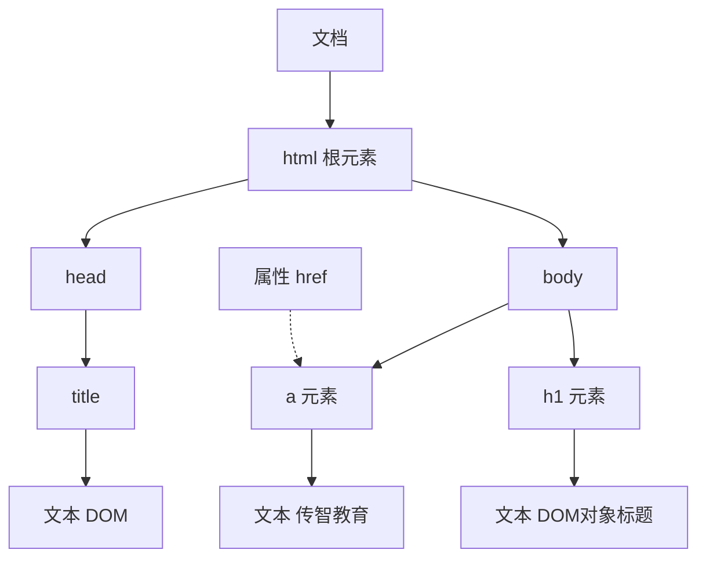

# JavaScript 基础

**弱类型语言**：定义函数时，形参、返回值都**无需指定类型**。

## 1. 函数定义的三种写法

```javascript
// 1. 具名函数
function add(a, b) { return a + b; }

// 2. 函数表达式：把函数当作值赋给变量
let add = function (a, b) { return a + b; }

// 3. 箭头函数：写法最简，但 this 行为与上面两种不同
let add = (a, b) => { return a + b; }
```

## 2. 自定义对象

```javascript
// 完整写法：方法用 function 关键字
let 对象 = { 属性名: 属性值, 方法名: function () { ... } }

// 简写：方法名后直接跟括号
let 对象 = { 属性名: 属性值, 方法名() { ... } }
```

> 在定义对象中的方法时，尽量**不要使用箭头函数**。
>
> **原因**：箭头函数**没有自己的 `this`**，它的 `this` 在**定义时**就锁定为外层作用域的 `this`——而对象字面量 `{}` 不构成作用域，所以外层通常是全局（或模块）作用域。结果就是通过 `对象.方法名()` 调用时，`this` 并不指向这个对象。`function` 写法的方法则相反，`this` 由**调用方式**决定，`对象.方法名()` 调用时指向该对象。

## 3. JSON

**概念**：JavaScript Object Notation，JavaScript 对象标记法——用 JS 对象标记法书写的**文本**。

> 由于语法简单、层次结构鲜明，现多用于作为**数据载体**，在网络上进行数据传输。

**JS 对象 与 JSON 文本互转**：

| 方向              | 方法                   | 说明       |
| --------------- | -------------------- | -------- |
| JSON 文本 → JS 对象 | `JSON.parse(文本)`     | 收到响应后解析  |
| JS 对象 → JSON 文本 | `JSON.stringify(对象)` | 发送请求前序列化 |

| 对比项  | JS 对象                        | JSON 文本                 |
| ---- | ---------------------------- | ----------------------- |
| 属性名  | 可省略引号                        | **必须用双引号**              |
| 值的类型 | 任意（含函数、`undefined`、`Date` 等） | 仅字符串、数字、布尔、`null`、数组、对象 |
| 本质   | 内存中的数据结构                     | 一段**字符串**               |

> 所以跨网络传输时必须转换：`JSON.stringify()` 序列化时会**丢掉值为 `undefined` 或函数的属性**，`JSON.parse()` 也只能还原出纯数据——凡是要过 JSON 的内容，必须是**纯数据**。

## 4. DOM

**概念**：Document Object Model，**文档对象模型**。

把标记语言的各个组成部分**封装为对应的对象**：

| 对象 | 对应部分 |
| --- | --- |
| `Document` | 整个文档对象 |
| `Element` | 元素对象 |
| `Attribute` | 属性对象 |
| `Text` | 文本对象 |
| `Comment` | 注释对象 |

**JavaScript 通过 DOM 就能对 HTML 进行操作**：

- 改变 HTML 元素的**内容**
- 改变 HTML 元素的**样式**（CSS）
- 对 HTML DOM **事件**作出反应
- **添加和删除** HTML 元素

### 4.1 DOM 树

文档被解析成一棵**树**，元素、属性、文本都是树上的节点：



## 5. 事件监听

```javascript
事件源.addEventListener('事件类型', 事件触发执行的函数);
```

```html
<input id="btn" type="button" value="点我一下试试2">
<script>
  document.querySelector('#btn').addEventListener('click', () => {
    alert('试试就试试');
  })
</script>
```

### 5.1 早期版本写法（了解）

`事件源.on事件 = function(){ ... }`

```html
<script>
  document.querySelector('#btn').onclick = function () {
    alert('试试就试试');
  }
</script>
```

> **区别**：`on` 方式会被**覆盖**，`addEventListener` 方式可以**绑定多次**，拥有更多特性，推荐使用。

## 6. 常见事件

| 分类 | 事件 | 触发时机 |
| --- | --- | --- |
| **鼠标事件** | `click` | 鼠标点击 |
| | `mouseenter` | 鼠标移入 |
| | `mouseleave` | 鼠标移出 |
| **键盘事件** | `keydown` | 键盘按下触发 |
| | `keyup` | 键盘抬起触发 |
| **焦点事件** | `focus` | 获得焦点触发 |
| | `blur` | 失去焦点触发 |
| **表单事件** | `input` | 用户输入时触发 |
| | `submit` | 表单提交时触发 |

```javascript
// click：鼠标点击事件
document.querySelector('#b2').addEventListener('click', () => {
  printLog("我被点击了...");
})
```

> 上面用到的 `printLog` 来自另一个 js 文件，见第 7 节模块化。

## 7. 模块化（export / import）

**JS 程序优化**的手段之一：把代码按职责拆到多个 js 文件，通过 `export` / `import` 互相引用。

引入脚本时必须声明 `type="module"`，否则 `import` / `export` 不生效：

```html
<!-- xxxx.html -->
<script src="./js/eventDemo.js" type="module"></script>
```

**导出**（`js/utils.js`）：

```javascript
export function printLog(msg) {
  console.log(msg);
}
```

**导入**（`js/eventDemo.js`）：

```javascript
import { printLog } from './utils.js'

// 之后即可直接使用
printLog("我被点击了...");
```

> 导入路径要写全文件名（含 `.js`）。
