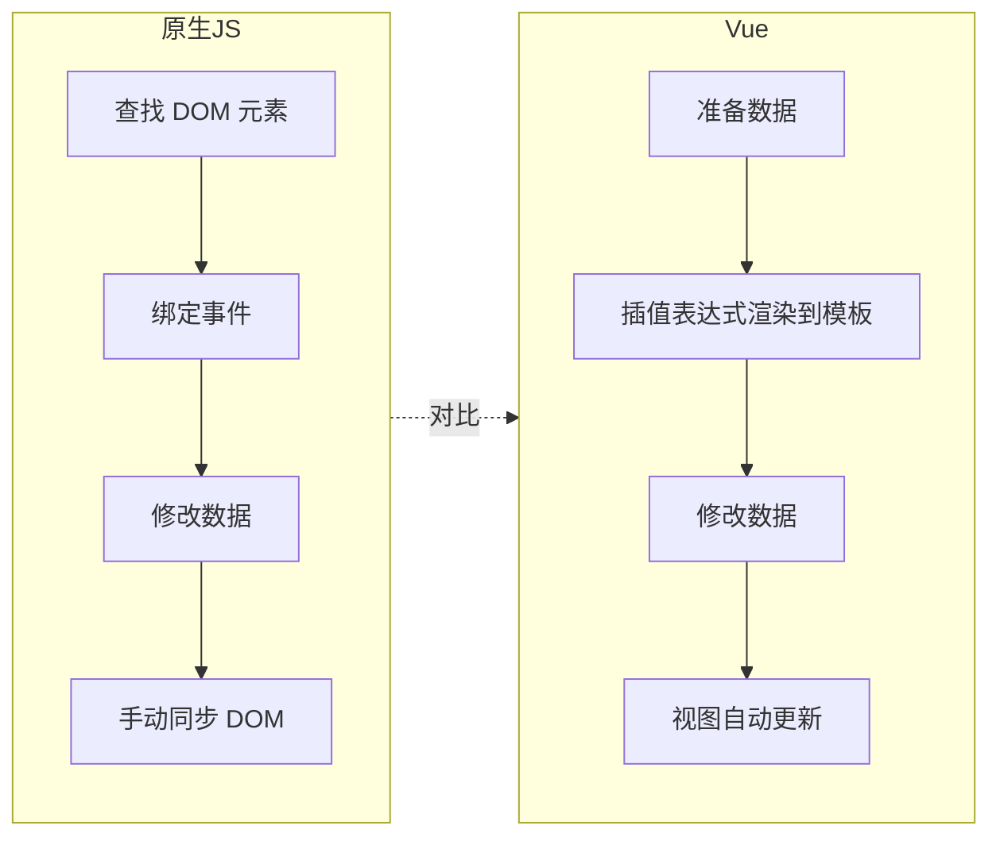
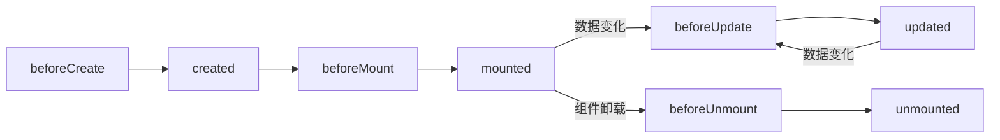

# Vue

## 1. 什么是 Vue

**Vue 是一款用于构建用户界面的渐进式 JavaScript 框架**（官方文档：https://cn.vuejs.org/ ）。

- **渐进式**：框架可以按层按需使用，只用核心包做局部改造，或全家桶做整站开发，不必一次性全上。
- **Vue 是一个框架，也是一个生态**：

| 层次 | 组成 | 解决的问题 |
| --- | --- | --- |
| Vue 核心包 | 声明式渲染、组件系统 | 数据驱动视图 |
| 官方插件 | VueRouter（客户端路由）、Vuex / Pinia（状态管理） | 单页应用的路由与共享状态 |
| 构建工具 | Webpack、Vite | 工程化开发 |

> 两种典型用法：**Vue 核心包** → 对已有页面做局部模块改造；**Vue 核心包 + 插件工程化** → 整站（SPA）开发。

## 2. 核心思想：数据驱动视图

传统 JS 是**手动操作 DOM**，Vue 让**数据变化自动驱动视图更新**：



> 注意：`count++` 这类操作**仍是自己修改数据**，Vue 自动的是"数据 → 视图"的同步，不是帮你改数据。

## 3. 快速入门（代码框架）

```html
<div id="app">
  <h1>{{message}}</h1>        <!-- 插值表达式：把数据渲染进页面 -->
  <button @click="count++">+</button>  <!-- 指令：绑定事件、操作数据 -->
</div>
<script type="module">
  import { createApp } from 'vue.esm-browser.js';  // 引入 Vue 模块（官方 CDN）
  createApp({
    data() { return { message: 'Hello Vue', count: 0 } },  // 准备数据
  }).mount('#app');   // 创建应用实例，接管 #app 区域
</script>
```

三个关键步骤：
1. **引入 Vue 模块**（官方提供 CDN 或 npm 安装，具体方式询问 AI 即可）。
2. **`createApp()` 创建应用实例**，`data()` 返回视图要用的数据。
3. **`.mount(选择器)`** 把实例挂载到页面元素上，该区域交给 Vue 控制。

## 4. 常用指令

> 示例代码见 `web-ai-code\vue\vue3-directives.html`

## 5. 生命周期

**生命周期：指一个对象从创建到销毁的整个过程。**

Vue 把一个组件的这一过程拆成**八个阶段**，每触发一个生命周期事件，就会自动执行对应的生命周期方法（**钩子函数**）。

八个阶段可归为四组：**创建 → 挂载 → 更新 → 销毁**，其中更新可反复触发。



典型应用场景：**页面加载完毕时就发起异步请求，加载数据、渲染页面**——即把请求写在 `mounted` 里。

```javascript
const app = createApp({
  data() { return { message: 'Hello Vue' } },
  // 生命周期-钩子函数 mounted
  mounted() {
    console.log('Vue挂载完毕，发送请求获取数据 ...');
  }
}).mount('#app');
```