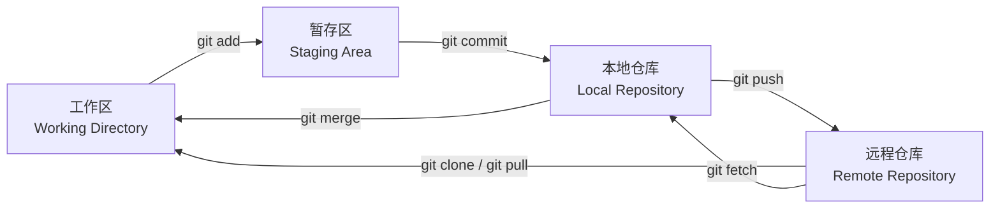

# Git分区概念

Git把代码的存在状态分成**四个区**，各种命令的本质都是在**这些区之间搬运数据**。

| 区                             | 说明                       |
| ----------------------------- | ------------------------ |
| **工作区**（Working Directory）    | 直接编辑文件的地方                |
| **暂存区**（Staging Area / Index） | 提交前的缓冲区，存放**已挑选、待提交**的改动 |
| **本地仓库**（Local Repository）    | 本机的版本库                   |
| **远程仓库**（Remote Repository）   | 远端服务器上的仓库                |

| 命令 | 搬运方向 |
| --- | --- |
| `git clone` | 远程仓库 → 工作区 |
| `git add` | 工作区 → 暂存区 |
| `git commit` | 暂存区 → 本地仓库 |
| `git push` | 本地仓库 → 远程仓库 |
| `git pull` | 远程仓库 → 工作区 |
| `git fetch` | 远程仓库 → 本地仓库 |
| `git merge` | 本地仓库 → 工作区 |

> **为什么要有暂存区**：`add`与`commit`拆成两步，就能**挑选**哪些改动进入这次提交——一个文件里的多组改动可以分几次提交，提交粒度由人控制，而不是"改了什么都得一起提交"。

> **提交的是暂存区的快照**：`git commit`不带参数时只打包暂存区，工作区里没`add`的改动不进提交；已经`add`进暂存区的内容也不能只提交其中一半。

> **提交前还能改主意**：放进暂存区的内容，在正式提交前都还能调整——
>
> | 想做的事 | 命令 |
> | --- | --- |
> | 把文件从暂存区撤回 | `git restore --staged <file>` |
> | 只提交指定文件，其余已暂存的先不动 | `git commit <path>` |
> | 按改动块（hunk）挑选，同一文件拆成几次提交 | `git add -p` / `git commit -p` |
>
