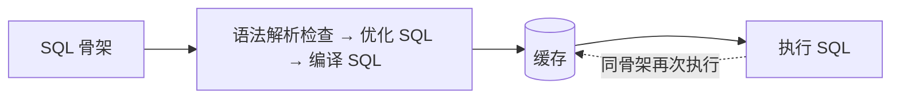
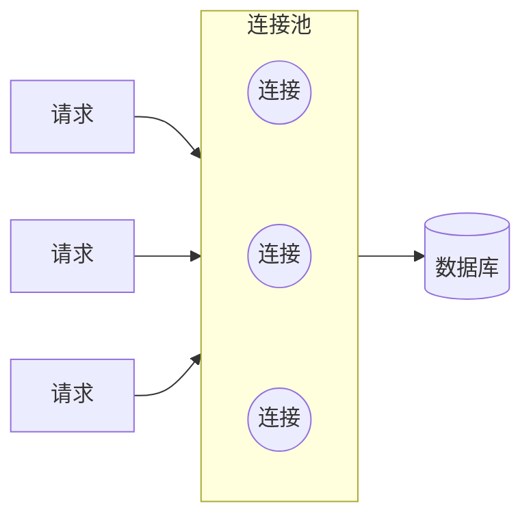

# JDBC

**JDBC（Java Database Connectivity）**：Java 访问关系型数据库的**标准 API**，只定义接口（`Connection`、`Statement`、`ResultSet`），具体的实现由各数据库厂商提供的**驱动（Driver）** 负责——所以换一种数据库，Java 代码基本不动，换驱动即可。

## 1. 一次 JDBC 操作的五步

| 步骤 | 关键点 |
| --- | --- |
| 1. 注册驱动 | `Class.forName(...)` 把驱动类加载进来 |
| 2. 获取连接 | `DriverManager.getConnection(url, username, password)`，url 定位到具体的库 |
| 3. 获取执行对象 | 由连接创建 `Statement` 或 `PreparedStatement`（预编译，推荐，见 §2），SQL 靠它送出去 |
| 4. 执行 SQL | 增删改用 `executeUpdate`，查询用 `executeQuery` |
| 5. 释放资源 | **后开先关**：`ResultSet` → `Statement` → `Connection` |

> 类名、方法名、Maven 依赖坐标（如 `mysql-connector-j`），用到时问 AI。

### 1.1 ResultSet：游标式读取

查询结果 `ResultSet` 的模型是**游标**，不是可以随便访问的集合。
所以读取结果是固定套路——**先移动、再取值**：

```java
while (resultSet.next()) {      // 先移动到有效行
    int id = resultSet.getInt("id");   // 再在当前行取值
    //......
}
```

## 2. 预编译 SQL：防注入与复用编译结果

`Statement` 把参数**拼进 SQL 字符串**再发出去；`PreparedStatement` 则先发送带 `?` 占位符的 **SQL 骨架**交给数据库预编译，之后再单独传参。多这一步，换来两个优势。

### 2.1 优势一：防止 SQL 注入

SQL 注入：通过控制输入来修改事先定义好的 SQL 语句，以达到执行代码对服务器进行攻击的方法。典型入口是登录这类拿用户输入拼 SQL 的地方：

```java
// 拼字符串：输入能改写整条 SQL 的语义
String sql = "select * from user where username = '" + username + "' and password = '" + password + "'";
```

> 账号处输入 `' or '1'='1`，`where` 条件会被改成恒真，密码校验直接被绕过。

**为什么预编译能防住**：SQL 骨架在**传参之前就已经编译定型**，此后占位符里的内容只会被当作**一个值**，不再参与语法解析——参数里带引号、`or`、分号，都改变不了语句的结构。

### 2.2 优势二：性能更高

数据库收到 SQL 后不是直接执行，前面还有一串准备步骤；预编译的产物会被**缓存**下来：



| 写法 | 连续执行 `delete from user where id = 1 / 2 / 3` |
| --- | --- |
| 拼字符串 | 3 条**不同的** SQL → 3 遍「解析 → 优化 → 编译」 |
| 预编译 | 1 条骨架 + 3 组参数 → 只准备 1 遍，后两次直接命中缓存 |

> 缓存的 **key 是 SQL 骨架**（如 `delete from user where id = ?`），参数值不同不影响命中。
## 3. JDBC 的三个痛点

手写 JDBC 能跑通，但把它当作生产方案有三个绕不开的问题——这也正是后面 MyBatis、连接池出现的理由：

| 痛点 | 具体表现 | 后来怎么解决 |
| --- | --- | --- |
| **硬编码** | url、驱动类名、用户名密码全写死在 Java 代码里 | 配置外置到配置文件（如 `application.properties`），代码只读配置 |
| **繁琐** | 结果集到对象的映射要手写：逐列 `getXxx`，再 `new` 对象、塞进 `List` | ORM 框架自动映射（MyBatis 用接口 + 注解/SQL 映射，一行 `List<User> findAll()` 替代整段循环） |
| **资源浪费、性能降低** | 每来一个请求就走一遍「建立物理连接 → 用完关闭」 | **数据库连接池** |

```java
// 硬编码的典型样子：连接信息散落在代码里
String url = "jdbc:mysql://localhost:3306/web";
Connection connection = DriverManager.getConnection(url, "root", "1234");
```

## 4. 数据库连接池

**数据库连接池**是一个**容器**，负责分配和管理数据库连接（`Connection`）：应用不再自己新建连接，而是向池**借用**、用完**归还**，池子让连接被**重复使用**。



**优势**：

1. **资源重用**——物理连接被反复使用，不必每次重建。
2. **提升系统响应速度**——省掉了建立连接的那段耗时。
3. **避免数据库连接泄漏**——空闲时间超过**最大空闲时间**的连接会被池释放回收，不会因为某处忘记释放而一直占着。

> 连接池解决的是「连接的创建与销毁」这层开销；MyBatis 这类框架默认就集成了连接池，这也是它相对裸 JDBC 优势的一部分。
