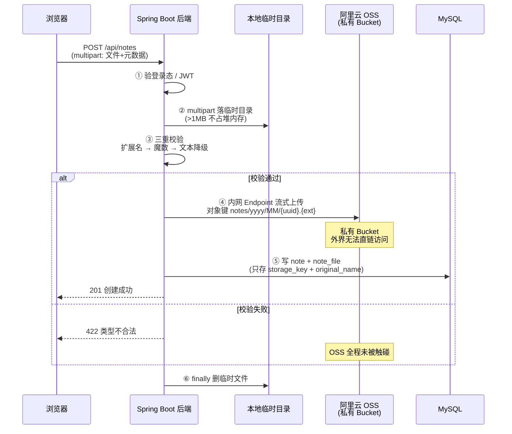
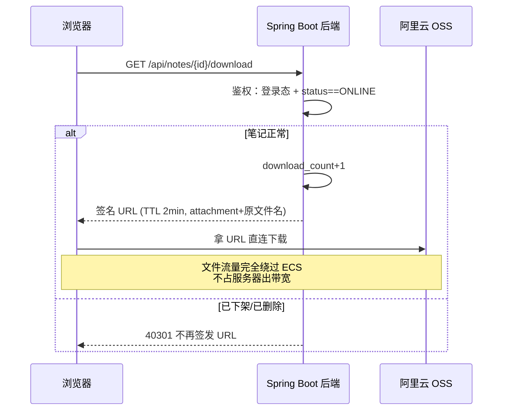

## 上传文件：

```mermaid
sequenceDiagram
    participant U as 浏览器
    participant A as Spring Boot 后端
    participant T as 本地临时目录
    participant O as 阿里云 OSS<br/>(私有 Bucket)
    participant DB as MySQL

    U->>A: POST /api/notes<br/>(multipart: 文件+元数据)
    A->>A: ① 验登录态 / JWT
    A->>T: ② multipart 落临时目录<br/>(>1MB 不占堆内存)
    A->>A: ③ 三重校验<br/>扩展名 → 魔数 → 文本降级
    alt 校验通过
        A->>O: ④ 内网 Endpoint 流式上传<br/>对象键 notes/yyyy/MM/{uuid}.{ext}
        Note over O: 私有 Bucket<br/>外界无法直链访问
        A->>DB: ⑤ 写 note + note_file<br/>(只存 storage_key + original_name)
        A-->>U: 201 创建成功
    else 校验失败
        A-->>U: 422 类型不合法
        Note over O: OSS 全程未被触碰
    end
    A->>T: ⑥ finally 删临时文件
```

## 读取文件：

```mermaid
sequenceDiagram
    participant U as 浏览器
    participant A as Spring Boot 后端
    participant O as 阿里云 OSS

    U->>A: GET /api/notes/{id}/download
    A->>A: 鉴权：登录态 + status==ONLINE
    alt 笔记正常
        A->>A: download_count+1
        A-->>U: 签名 URL (TTL 2min, attachment+原文件名)
        U->>O: 拿 URL 直连下载
        Note over U,O: 文件流量完全绕过 ECS<br/>不占服务器出带宽
    else 已下架/已删除
        A-->>U: 40301 不再签发 URL
    end
```